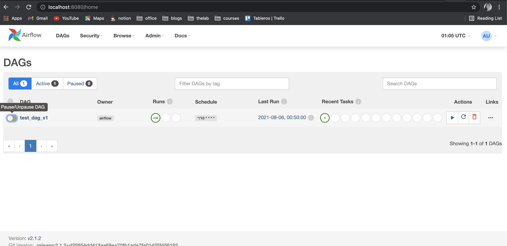

# Airflow Deployment for EKS

This folder contains the configuration required for deploying Airflow on the EKS cluster using [Helm](https://helm.sh).

It is based on the official repo [Airflow Helm Chart](https://github.com/apache/airflow/tree/master/chart), currently using airflow version 2.1.2. 

Installation is on a EKS Kubernetes Cluster.


## Requirements

* AWS CLI
* Kubectl
* Helm

## Deployment

### Cluster

In order to install the Kubernetes cluster follow the steps with Terraform at the main [README.md](../README.md)

### CSI Driver
If you want to have a storage for the nodes, you can use a CSI Driver. In this repo, the configuration for EBS and EFS is provided. 
You would have to choose one of them. Plus, configure the worker's deployment at [templates/workers/worker-deployment.yaml](templates/workers/worker-deployment.yaml) changing in these lines the claimName for the corresponding name:       

```yaml
 volumes:
      - name: task-pv-storage
        persistentVolumeClaim:
          claimName:  efs-claim
```

If you want to disable it, just comment those lines and these other lines:     
```yaml
            - mountPath: "/input"
              name: task-pv-storage
```
Note: with EFS CSI driver, you are able to set the accessMode as 'ReadWriteMany', which let the nodes to share the volume and read and write at the same time. 

Once that you have choosen which CSI Driver to use (pre-provisioned-efs or pre-provisioned-ebs):

1. Follow the steps provided in [chart/pre-provisioned-ebs/README.md](chart/pre-provisioned-ebs/README.md)  or [chart/pre-provisioned-efs/README.md](chart/pre-provisioned-efs/README.md) 

2. Execute this command:   
For EBS:     
```bash
kubectl apply -f pre-provisioned-ebs/ 
```

For EFS:     
```bash
kubectl apply -f pre-provisioned-efs/ 
```


### Airflow

Once Kubernetes cluster is created we are able to install airflow. 

**Create airflow namesapce and set as default**     

```bash
  kubectl create namespace airflow
  kubectl config set-context --current --namespace=airflow
```

**Note:** The folder [chart](airflow/chart) has been downloaded from [airflow repository](https://github.com/airflow-helm/charts/tree/main/charts/airflow). The following steps has been executed: (if you use this chart you can skip these steps)    

1. Download the chart folder from the airflow repository at [https://github.com/apache/airflow/tree/master/chart](https://github.com/apache/airflow/tree/master/chart) with the following command:

	```bash
	  pip install git+git://github.com/HR/github-clone#egg=ghclone
	   ghclone https://github.com/apache/airflow/tree/master/chart
	```
2. The following files has been modified: 
	- requirements.yml 
	- add folder postgres For creating the database
	- [values.yml](chart/values.yml): this file has been modified to configure container's image names and git repository, you should modify it for your convenience.  
	
**Add airflow repo to helm**     
	
```bash
  helm repo add apache-airflow https://airflow.apache.org
```

**Install the airflow chart**    
Helm uses a packaging format called 'charts'. A chart refers to a collection of files that describe a related set of Kubernetes resources. 

```bash
cd chart
helm install airflow -n airflow .
```
**Update the chart**       
If you apply changes to the files of the chart, you can make those updates on the cluster by executing the following command:        
  
```bash
  helm upgrade airflow -n airflow .
```

**Validate service and pods and check the Status**     
   
```bash
  kubectl get all -n airflow 
```

**Access Airflow web by port-forwarding**

```bash
  export POD_NAME=$(kubectl get pods --field-selector=status.phase=Running -o go-template --template '{{range .items}}{{.metadata.name}}{{"\n"}}{{end}}' | grep 'web')
  kubectl port-forward --namespace airflow $POD_NAME 8080:8080
```
Enter at Enter at [http://localhost:8080/](http://localhost:8080/)

You will see the Airflow website, you can login with admin:admin.



You can execute the given example DAG  by pressing the button. And if you enter to the DAG, you will see the status for each task. 


**Access Flower web**

```bash
  export POD_NAME=$(kubectl get pods --field-selector=status.phase=Running -o go-template --template '{{range .items}}{{.metadata.name}}{{"\n"}}{{end}}' | grep 'flower')
  kubectl port-forward --namespace airflow $POD_NAME 5555:5555
```

Enter at [http://localhost:5555/](http://localhost:5555/) and login with admin:admin.


## Logs
Here are provided a few commands that are useful to see logs and status of the pods. 

* Identify pod ids:

```bash
  $ kubectl get pods
    NAME                                 READY   STATUS    RESTARTS   AGE
  airflow-flower-6d6bb84fcc-dpnx4      1/1     Running   0          11m
  airflow-postgres-5f5575d874-kgq76    1/1     Running   0          11m
  airflow-redis-0                      1/1     Running   0          11m
  airflow-scheduler-7df6b55dc9-vpz89   3/3     Running   0          11m
  airflow-statsd-84f4f9898-kb9hj       1/1     Running   0          11m
  airflow-webserver-59f7f57d74-8hb66   1/1     Running   0          11m
  airflow-worker-5845dc5799-df7g8      2/2     Running   0          11m
```

* Web

```bash
  kubectl logs airflow-webserver-59f7f57d74-8hb66 
```
* Scheduler

```bash
  kubectl logs airflow-scheduler-7df6b55dc9-vpz89 -c scheduler-gc 
```
* Worker

```bash
  kubectl logs airflow-worker-5845dc5799-df7g8  
```

## Giving access to new users 

1. If you want to add more users, you should edit the configmap      
	
	```bash
	  kubectl edit configmap aws-auth -n kube-system
	```
	
	You should add these lines with the corresponding user's information    
	
	```bash
	  mapUsers: |
	    - userarn: arn:aws:iam::${ACCOUNT_ID}:user/${USERNAME}
	      username: ${USERNAME}
	      groups:
	        - system:masters
	```
2. The new user needs to execute the following lines to login to the cluster 

	```bash
	  aws eks update-kubeconfig --name sandbox-eks-cluster --region us-west-2
	
	  kubectl config set-context --current --namespace=airflow
	
	  kubectl get pods 
	
	```

## Login into database 
If you want to access the database, you can execute the following command. Firts, it gets the pod's id and then execute a command in the container that lets you access to the database. 
Notice that you should change the [values.yaml](chart/values.yaml) configuration for your database.  

```bash
  export POD_NAME=$(kubectl get pods --field-selector=status.phase=Running -o go-template --template '{{range .items}}{{.metadata.name}}{{"\n"}}{{end}}' | grep 'postgres')
  kubectl exec -ti $POD_NAME -- psql -d airflow -U airflow
```

It is a Postgres Database, so you can any command to make queries. For instance, if you want to  list the tables: 

```bash
 \dt
```

## Custom image
You can create your custom image to launch airflow with the necessary dependencies for your DAGs. 
In that case, you should edit the [values.yaml](chart/values.yaml) file with the corresponding image name and version. 


