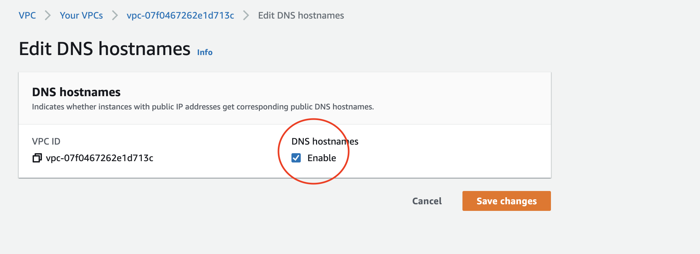

### EFS CSI Driver    
   
The airflow chart provided is configured to use EFS CSI driver for worker's volume. It allows multiple pods to read and write at the same time. You can install it following these [steps](https://aws.amazon.com/premiumsupport/knowledge-center/eks-persistent-storage/) - Option B. Here are provided for you: 

Notice that the name for the cluster in this case is **sandbox-eks-cluster**. 

```bash
curl -o iam-policy-example.json https://raw.githubusercontent.com/kubernetes-sigs/aws-efs-csi-driver/v1.2.0/docs/iam-policy-example.json

aws iam create-policy \
    --policy-name AmazonEKS_EFS_CSI_Driver_Policy \
    --policy-document file://iam-policy-example.json

export CLUSTER_OIDC=$(aws eks describe-cluster --name your_cluster_name --query "cluster.identity.oidc.issuer" --output text)
echo $CLUSTER_OIDC
```

Create file **'trust-policy.json'**, with the following content, changing the values:      
 **{ACCOUNT\_ID}** with the account id shown in the website (Account Settings -> Account Id)        
 **{REGION}** with the corresponding choosen region for your cluster (execute kubectl cluster-info if you don't know)       
 **{CLUSTER\_OIDC}** with the corresponding value for your cluster in the variable CLUSTER_OIDC exported in the line before     
         
```json
cat <<EOF > trust-policy.json
{
  "Version": "2012-10-17",
  "Statement": [
    {
      "Effect": "Allow",
      "Principal": {
        "Federated": "arn:aws:iam::YOUR_AWS_ACCOUNT_ID:oidc-provider/oidc.eks.{REGION}.amazonaws.com/id/{CLUSTER_OIDC}>"
      },
      "Action": "sts:AssumeRoleWithWebIdentity",
      "Condition": {
        "StringEquals": {
          "oidc.eks.{REGION}.amazonaws.com/id/{CLUSTER_OIDC}:sub": "system:serviceaccount:kube-system:efs-csi-controller-sa"
        }
      }
    }
  ]
}
EOF
```

Create Role and Policy and attach it to the cluster's node role:  

```bash 
aws iam create-role \
  --role-name AmazonEKS_EFS_CSI_DriverRole \
  --assume-role-policy-document file://"trust-policy.json"


aws iam attach-role-policy \
  --policy-arn arn:aws:iam::$ACCOUNT_ID:policy/AmazonEKS_EFS_CSI_Driver_Policy \
  --role-name AmazonEKS_EFS_CSI_DriverRole  

aws iam attach-role-policy --policy-arn arn:aws-cn:iam::$ACCOUNT_ID:policy/AmazonEKS_EFS_CSI_Driver_Policy --role-name sandbox-eks-node-role

```

Create service account 
```yaml
cat << EOF > efs-service-account.yaml
---
apiVersion: v1
kind: ServiceAccount
metadata:
  name: efs-csi-controller-sa
  namespace: kube-system
  labels:
    app.kubernetes.io/name: aws-efs-csi-driver
  annotations:
    eks.amazonaws.com/role-arn: arn:aws:iam::$ACCOUNT_ID:role/AmazonEKS_EFS_CSI_DriverRole
EOF
```

Deploy 
```bash
kubectl apply -f efs-service-account.yaml
kubectl apply -k "github.com/kubernetes-sigs/aws-efs-csi-driver/deploy/kubernetes/overlays/stable/ecr/?ref=release-1.1"
	YOUR_VPC_ID=$(aws eks describe-cluster --name sandbox-eks-cluster --query "cluster.resourcesVpcConfig.vpcId" --output text)
	YOUR_VPC_CIDR=$(aws ec2 describe-vpcs --vpc-ids $YOUR_VPC_ID --query "Vpcs[].CidrBlock" --output text)
	aws ec2 create-security-group --description efs-test-sg --group-name efs-sg --vpc-id $YOUR_VPC_ID
	SG_ID=$(aws ec2 describe-security-groups --filters Name=vpc-id,Values=vpc-07f0467262e1d713c Name=group-name,Values=efs-sg --query "SecurityGroups[*].{ID:GroupId}" --output text)
	aws ec2 authorize-security-group-ingress --group-id $SG_ID --protocol tcp --port 2049 --cidr $YOUR_VPC_CIDR
	aws efs create-file-system --creation-token eks-efs
```

Get subnets ids 
```bash
aws ec2 describe-subnets --filters "Name=vpc-id,Values=$YOUR_VPC_ID"  --query "Subnets[*].{ID:SubnetId} --output text
```
For each subnet id do:
```bash 
aws efs create-mount-target --file-system-id FileSystemId --subnet-id $SubnetID --security-group $SG_ID
```

Enable DNS for the VPC
You need to go to the AWS website at the VPCs configuration, edit it to enable DNS hostname, in this case the VPC is under the name 'sandbox-vpc'.

Edit chart at [pv.yaml](pv.yaml) setting the volumeHandle value with the corresponding for the efs created. You can check it at the website. 



> **⚠ WARNING: maybe you already have named roles or policies with the provided names, in that case use other names, and make sure that you change then other steps, in order to attack correctly the role and policy.** 

**Delete role and policy**
If you want to delete the role and policies execute the following:      

  ```bash 
     aws iam detach-role-policy --role-name AmazonEKS_EFS_CSI_DriverRole --policy-arn arn:aws-cn:iam::${ACCOUNT_ID}:policy/AmazonEKS_EFS_CSI_Driver_Policy 
     aws iam delete-role  --role-name AmazonEKS_EFS_CSI_DriverRole 
  ```
